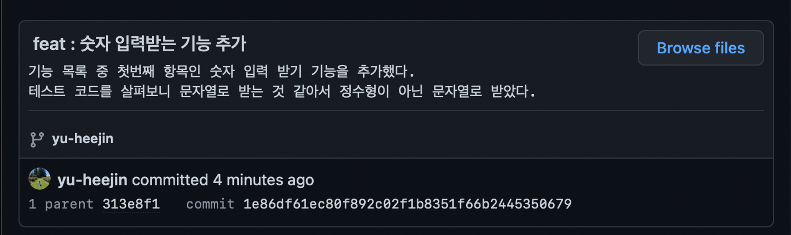

## Commit Message Form

<aside>
💡 {type}: {message} (#{issueNumber})
{description (optional)}

</aside>

- `description`은 첫 줄 작성 후 엔터를 누르면 작성할 수 있습니다. (선택 사항)

### 사용 예시



```
feat: board create 테스트 코드 작성 (#32)
board 도메인에서 게시물을 생성하는 테스트 코드를 @WebMvcTest를 사용하여 작성했다.
```

## Type

- gitmoji를 사용하여 어떤 타입인지 명확하게 표시해주세요.
- 메세지 타입은 반드시 소문자를 사용해주세요.

| Type | Description |
| --- | --- |
| ✨ feat | 새로운 기능 추가 시 사용합니다. |
| 🐛 fix | 오류 수정 시 사용합니다. |
| 📝 docs | README.md 등의 문서 작성 및 수정 시 사용합니다. |
| 🎨 style | 들여쓰기, 케이스 등 코드 스타일 변경 시 사용합니다. (ex. 카멜 케이스 → 스네이크 케이스) |
| ♻️ refactor | 불필요한 코드 삭제, 코드 리팩토링 등의 전반적인 프로젝트 리팩토링 시 사용합니다. |
| 🧪 test | 테스트 코드 작성 시 사용합니다. |
| 👷‍♂️ ci/cd | CI/CD 설정 파일 수정 시 사용합니다. |
| 🚑 hotfix | 치명적인 오류를 급히 수정할 때 사용합니다. |
| ✏️ rename | 파일 이름 변경 시 사용합니다. |
| ⚡️ perf | 성능 개선 시 사용합니다. |
| 💫 chore | 기타 사소한 수정 시 사용합니다. |

## Message

- 메세지는 ‘~다’로 끝나지 않으며, **한 줄로 요약**합니다.
    - 상세한 내용을 작성하고자 한다면 `description` 위치에 적어주세요.
- 메세지를 깔끔하게 작성하기 위해 **기능 구현 단위로 commit** 해주세요.
- `description`은 **무엇을, 왜 했는지 등의 상세한 내용**을 작성해주세요.

## 참고 사이트

[AngluarJS commit convention (번역본)](https://velog.io/@outstandingboy/Git-%EC%BB%A4%EB%B0%8B-%EB%A9%94%EC%8B%9C%EC%A7%80-%EA%B7%9C%EC%95%BD-%EC%A0%95%EB%A6%AC-the-AngularJS-commit-conventions#%EC%BB%A4%EB%B0%8B-%EB%A9%94%EC%8B%9C%EC%A7%80-%ED%97%A4%EB%8D%94-commit-message-header)

```toc
```